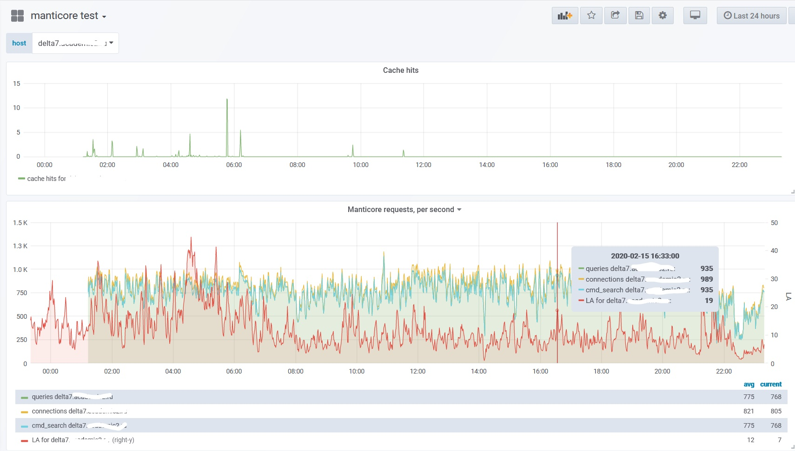

# purpose
collectd Exec type plugin to gather stats from Manticore ( https://manticoresearch.com )

# sample
## grafana graph




# collectd sample config
Refer to [official docs](https://collectd.org/wiki/index.php/Plugin:Exec), but in general it should work with quite simple config like that, using `default` as a name of instance (someone may want to run multiple manticore servers on the same host):
```
root@delta7:~# cat /etc/collectd/conf.d/10-exec.conf
# Generated by Puppet
<LoadPlugin exec>
  Globals false
</LoadPlugin>

root@delta7:~# cat /etc/collectd/conf.d/exec-config.conf
<Plugin exec>
  Exec "nobody:nogroup" "/opt/scripts/collectd/manticore.py" "default"

</Plugin>
```

# installation
## dependenices
On Debian/Ubuntu you should be okay after install mysql lib for python. I've used python3, but you may try on python 2.x as well, may be will work.
```
apt-get install python3-pymysql
```
